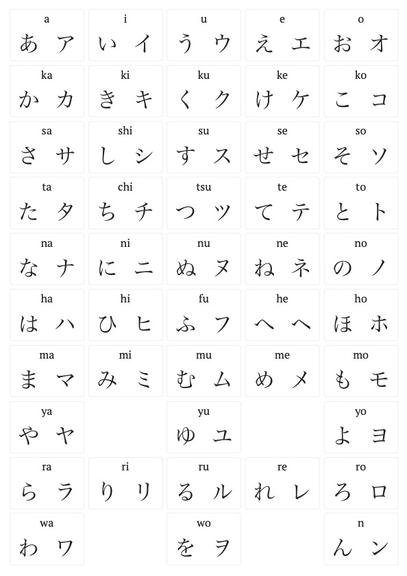
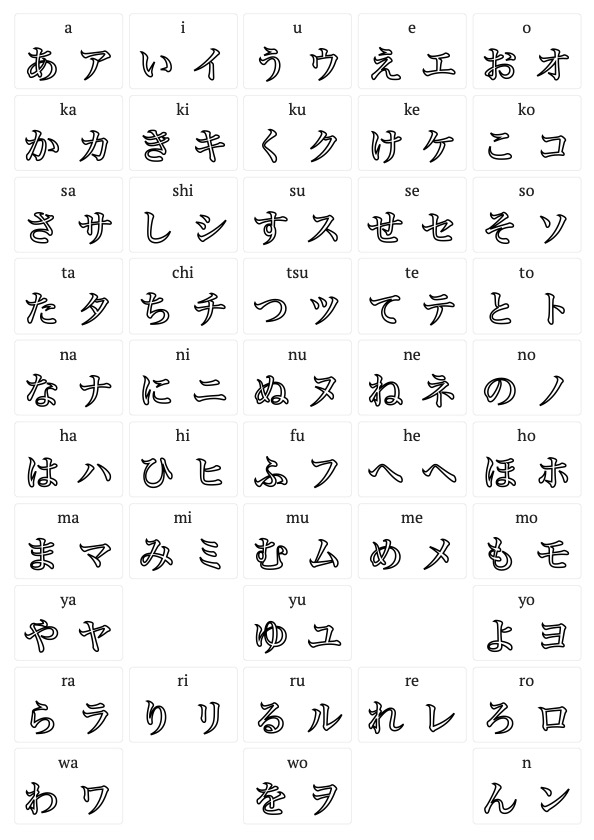

## Add content, format and print

Examples:

1. Text only with kana

   

   [PDF version](./resources/kana.pdf)

2. Text only with kana and stroke effect

   

   [PDF version](./resources/kana-stroke.pdf)

3. Text and images of kana

   

   [PDF version](./resources/kana-wiki.pdf)

## Editor

TODO

## Made possible by...

- [Material UI](https://mui.com/)
- [React-to-print](https://github.com/gregnb/react-to-print)
- [React-zoom-pan-pinch](https://github.com/prc5/react-zoom-pan-pinch)
- [React-image-crop](https://github.com/DominicTobias/react-image-crop)
- [React-dropzone](https://github.com/react-dropzone/react-dropzone)
- [React-virtualized-auto-sizer](https://github.com/bvaughn/react-virtualized-auto-sizer/)
- [React-hotkeys-hook](https://johannesklauss.github.io/react-hotkeys-hook/)
- [Hepburn](https://github.com/lovell/hepburn)

## Misc

[Theme Architect](https://github.com/pages-themes/architect)
